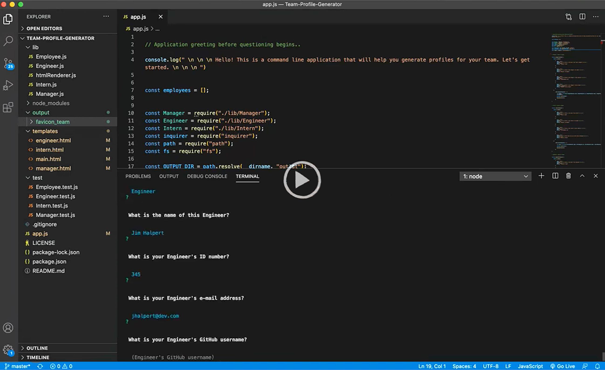
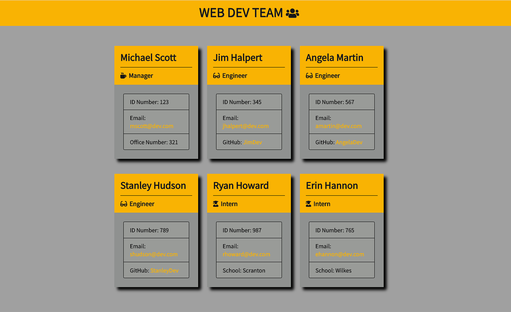

# A Team Profile Generator‏‏‎
‎‎ 
  

  ---
  
  <p>&nbsp;<p>
    

## Description 

<p>&nbsp;<p>

<strong><em>What is this project? Why did you make this project? How did you make this project?</strong></em>

<p>&nbsp;<p>

This template engine is a command line interface application that runs via Node.js & the Inquirer.js npm package. This application will deliver the user a series of questions regarding their team members or department, and their input is dynamically generated into an HTML file that displays those responses. The HTML is compiled via a series of templates, and will be a fully finished department profile with active links, after the user is finished adding the desired amount of employees. This is a quick and useful way for a company or department head to create a deployable webpage roster of their colleagues, by simply responding to a few prompts. 

<p>&nbsp;<p>


View a team profile sample that was directly generated using this application here =>‏‏‎ ‎‏‏‎ ‎‏‏‎ ‎‏‏‎[` Web.Dev.Team Sample `](https://jonathanschimpf.github.io/Team-Profile-Generator/)


<p>&nbsp;<p>


---

<p>&nbsp;<p>


## Table of Contents: 

<p>&nbsp;<p>

* [Installation](#installation)
* [Usage](#usage)
* [License](#license)
* [Credits](#credits)
* [Questions](#questions)

<p>&nbsp;<p>

---


<p>&nbsp;<p>


## Installation


<p>&nbsp;<p>


<strong><em>What are the steps required to install this project?</strong></em>


<p>&nbsp;<p>


To make use of this application, you must first download the repo, and then run `npm install` within the terminal to begin the install of `inquirer` & `jest`. Confirm this within the included `package.json` file. You can begin the series of questioning for your README by running `node app.js` within the terminal.


<p>&nbsp;<p>

The directory structure is set up in this manner:
```
lib/           // classes and helper code
output/        // rendered output
templates/     // HTML template(s)
test/          // jest tests
  Employee.test.js
  Engineer.test.js
  Intern.test.js
  Manager.test.js
app.js         // Runs the application
```


<p>&nbsp;<p>

(‏‏‎ ‎`/docs` + `/assets` ‏‏‎ ‎have been added to the repo for GitHub presentation purposes only.‏‏‎ ‎)

<p>&nbsp;<p>


---


<p>&nbsp;<p>


## Usage


<p>&nbsp;<p>


<strong><em>Instructions and examples for usage:</strong></em>

<p>&nbsp;<p>

Answer a series of questions about your department members, and receive a fully styled `HTML` employee profile that will be exported into the `/output` directory. This profile generator will display employee name, their role, their identification number, and role specific properties (links, school information, etc.)
<p>&nbsp;<p>

These prompts are possible via the `inquirer` package. The application is driven via JavaScript object oriented programming paradigm that uses constructors and classes (`ES6`). Information requests include employee identification, email, office number, and specific questions like GitHub profile information and School (for individuals interning). This type of information is stored within the Employee class, and specifics within the Intern, Manager, and Engineer classes. Proper generation is tested and syntax is confirmed thanks to `jest` npm. These tests can be run by entering `npm run test` in the command line. This test driven development approach confirms that code is both functional and understanable for future maintenance efforts.

<p>&nbsp;<p>


View a video overview on usage here:

[](https://drive.google.com/file/d/1qg8JFvDuz91SOhHopfzs-cpPsqSiGiiz/view?usp=sharing) 

<p>&nbsp;<p>

---

<p>&nbsp;<p>

[](https://jonathanschimpf.github.io/Team-Profile-Generator/)

<p>&nbsp;<p>

(‏‏‎ ‎♥ ‏‏‎ ‎The Office // For Demo Purposes Only‏‏‎ ‎)

<p>&nbsp;<p>


---


<p>&nbsp;<p>


## License


<p>&nbsp;<p>


This project is covered under the MIT license. 


<p>&nbsp;<p>


---


<p>&nbsp;<p>


## Credits


<p>&nbsp;<p>


<strong><em>Third party assets:</strong></em>


<p>&nbsp;<p>

`Node.js` =>‏‏‎ ‎ ‏‏‎ ‎[An asynchronous event-driven runtime built on Chrome's V8 JavaScript engine.](https://nodejs.org/en/)

<p>&nbsp;‏‏‎‏‏‎ ‎<strong>+</strong></p>


`inquirer npm` =>‏‏‎ ‎ ‏‏‎ ‎[A beautiful collection of common interactive command line user interfaces.](https://www.npmjs.com/package/inquirer)


<p>&nbsp; <strong>+</strong></p>

`jest` => ‏‏‎ ‎‏‏‎ ‎[A delightful out of the box JavaScript testing framework with a focus on simplicity.](https://https://jestjs.io/)


<p>&nbsp;<p>


---


<p>&nbsp;<p>


## Questions?


<p>&nbsp;<p>


Shoot me an e-mail! => jonathan@jonathanschimpf.com

<p>&nbsp;<p>


Check out more of my work here on =>
[GitHub](http://github.com/jonathanschimpf)

<p>&nbsp;<p>


